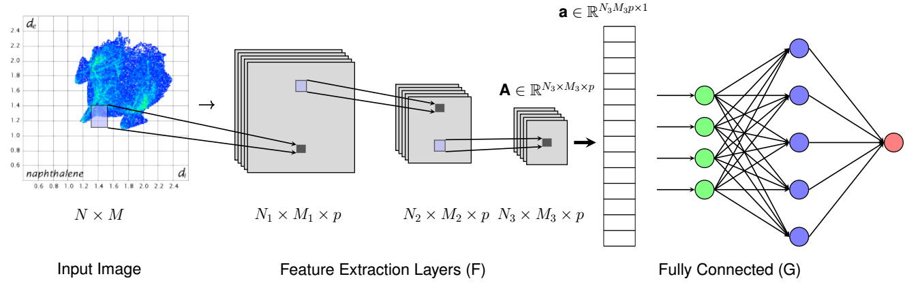

# Atomic Hirshfeld Surface Fingerprint

This software package takes an arbitary crystal structure to predict material properties.

#### Table of Contents

- [Prerequisites](#prerequisites)
- [How to Use](#how-to-use)
- [How to Cite](#how-to-cite)
- [Data](#data)
- [Authors](#authors)
- [License](#license)

##### Prerequisites

- [Pandas](#https://pandas.pydata.org/)
- [Keras](#https://keras.io/) (with [Tensorflow](#https://www.tensorflow.org/) backend)
- [Scikit-Learn](https://scikit-learn.org/stable/)
- [Seaborn](https://seaborn.pydata.org/) (for visualization)

##### How to use:

###### TODO

Training the model

###### Using a pre-trained model:

Download the package using the following code:

`git clone https://github.com/arpanisi/mof_single_atom_hs.git`

Use conda to create an environment as:

`conda create -n ahsfp python=3.7 scikit-learn keras tensorflow`

This creates a conda environment along with installing the prerequisites. Activate the environemnt by:

`conda activate ahsfp`

Navigate to the folder `/ahsfp` and type:

`(ahsfp) working_directory/ahsfp$ python predict.py`

Alternately it can be used by one of the following codes:

`python predict.py --parameter old_lattice` and
`python predict.py --parameter new_lattice`. The output of both the commands give the following output

<table align="center">
<td align="center">

</td>
<td align="center">

</td>
</table>

#### How to cite

TODO

#### Data

TODO

#### Architecture

The complete network architecture of ahsfp is given below:

| Name               | Output Shapes       | Parameters |
|--------------------|---------------------|------------|
| InputLayer         | (None, 50, 50, 1)   | 0          |
| Conv2D             | (None, 50, 50, 32)  | 320        |
| Conv2D             | (None, 50, 50, 32)  | 9248       |
| MaxPooling2D       | (None, 25, 25, 32)  | 0          |
| Dropout            | (None, 25, 25, 32)  | 0          |
| BatchNormalization | (None, 25, 25, 32)  | 128        |
| Conv2D             | (None, 25, 25, 64)  | 18496      |
| Conv2D             | (None, 25, 25, 64)  | 36928      |
| Conv2D             | (None, 25, 25, 64)  | 36928      |
| MaxPooling2D       | (None, 12, 12, 64)  | 0          |
| Dropout            | (None, 12, 12, 64)  | 0          |
| BatchNormalization | (None, 12, 12, 64)  | 256        |
| Conv2D             | (None, 12, 12, 128) | 73856      |
| Conv2D             | (None, 12, 12, 128) | 147584     |
| Conv2D             | (None, 12, 12, 128) | 147584     |
| Conv2D             | (None, 12, 12, 128) | 147584     |
| MaxPooling2D       | (None, 6, 6, 128)   | 0          |
| BatchNormalization | (None, 6, 6, 128)   | 512        |
| Flatten            | (None, 4608)        | 0          |
| Dense              | (None, 128)         | 589952     |
| Dropout            | (None, 128)         | 0          |
| BatchNormalization | (None, 128)         | 512        |
| Dense              | (None, 128)         | 16512      |
| Dropout            | (None, 128)         | 0          |
| BatchNormalization | (None, 128)         | 512        |
| Dense              | (None, 1)           | 129        |

#### Authors

This software is written by Arpan Mukherjee. Data Collection and analysis by Logan Williams. 
Arpan and Logan were advised by Prof. Krishna Rajan

Please use the following article to cite our work:

Williams, Logan, Arpan Mukherjee, and Krishna Rajan. "Deep Learning Based Prediction of Perovskite Lattice Parameters from Hirshfeld Surface Fingerprints." The Journal of Physical Chemistry Letters 11.17 (2020): 7462-7468.

#### License

released under the MIT License

